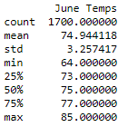
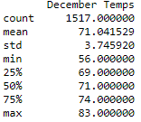
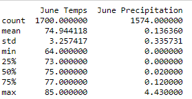
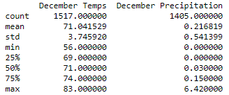

# Surfs Up Analysis

## Overview of Surfs Up Analysis
I want to open a Surf n’ Shake shop that serves surfboards and ice cream to locals, tourists, and myself. I need investor backing to get this off the ground. So, after putting together a strong business plan, I reach out to an invest W. Avy who is famous for his love of surfing. The first meeting with him goes extremely well but he has one concern. What about the weather? He invested in a surf shop early in his career. The early venture was rained out of existence. He asked if I can run some analytics on a weather dataset he has on the island of Oahu. 

W. Avy specfically wanted to see temperature data for the months of June and December in Oahu, in order to determine if the surf and ice cream shop business is sustainable year-round. 

## Results 
I examined temperature data for the months of June and December in Oahu to determine how sustainable the surf and ice cream shop business is year-round. 

Observations Comparing June and December Tempature: 
1. The difference in mean tempature between June and December is only around 4 degrees. 
2. The difference in minimum temperature between June and December is larger the difference in mean tempature. The difference for minimum tempature is around 8 degrees. The lower tempature may happen at night and might cause people to eat less ice cream at night in December. 
3. The difference in maximum temperature between June and December is only 3 degrees
4. The tempature remains relatively the same in June and December. Therefore, the ice cream shop business is sustainable year-round. 

Please see the summary statistics for June and December Tempatures: 

 

 

## Summary 
I ran additional analysis looking at precipitation for the months of June and December. Similarly to tempature, the precipitation remains relatively similar between the two months. Overall, the weather for June and December remains relatively constant and suitable for ice cream and surfing. From the weather analysis, I can conclude that an ice cream and surf business is sustainable year-round. 

Please see the summary statistucs for June and December Tempatures and Precipitation: 

 

 

